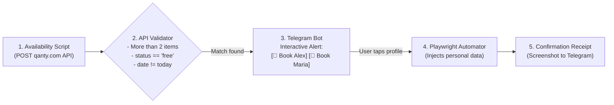

# 💊 SMS — Smart Medicine Scheduler

> **An automated, resilience-driven system for continuous medicine appointment monitoring, interactive Telegram notifications, and sub-second multi-profile booking via Playwright.**

[](https://www.typescriptlang.org/)
[](https://playwright.dev/)
[](https://grammy.dev/)
[](openspec/)
[](LICENSE)

---

## 📖 About The Project

Securing medicine pickup appointments at healthcare dispensaries and pharmacy networks (such as those powered by **Qanty**) is often frustrating and stressful. Appointment slots are scarce, released at unpredictable times of the day, and vanish within minutes. Families frequently spend hours manually refreshing web portals just to find a suitable time slot for essential prescription medication.

**Smart Medicine Scheduler (SMS)** solves this problem with an autonomous, high-speed pipeline:

1. **Continuous Non-Intrusive Polling**: Silently monitors dispensary schedules in the background using realistic browser signatures and adaptive polling.
2. **Deterministics Rules Engine**: Filters raw data against strict business rules to eliminate false positives and ignores same-day closed slots.
3. **Interactive Human-in-the-Loop Hub**: Delivers instant rich alerts to your Telegram app with one-tap action buttons for every registered family member.
4. **Sub-Second Automated Booking**: Upon tapping a profile button, high-speed **Playwright** automation injects the person's identity information, bypasses heavy tracking scripts via **Addy Osmani's resource routing patterns**, and sends back a screenshot receipt as proof of booking.

---

## 📐 High-Level Architecture



---

## ✨ Key Features

- ⚡ **The 3 Business Rules Validator**:
  1. **Multiplicity Rule**: Validates that the payload contains more than two items (`items.length > 2`).
  2. **Availability Rule**: Filters only slots with status explicitly marked as `free` or available.
  3. **Future Date Rule**: Excludes appointments scheduled for today (`date != today`), prioritizing actionable future slots.
- 🛡️ **Zero-Spam Deduplication**: Remembers notified slots in a lightweight state store so your phone only buzzes when genuinely new slots open up.
- 📱 **Interactive One-Tap Telegram Booking**:
  - Receive actionable notifications with date, time, medical specialty, and clinic branch.
  - One dedicated button per person (`[ 👤 Book Alex ]`, `[ 👤 Book Mom ]`, `[ ❌ Dismiss ]`).
- 🏎️ **Addy Osmani Headless Browser Optimizations**:
  - **Resource Routing**: Aborts heavy third-party tracking scripts (Google Analytics, Hotjar, Facebook Pixel) and unneeded fonts, speeding up form completion by up to **60%**.
  - **Diagnostic Tracing on Failure**: Records DevTools traces (`traces/trace_*.zip`) only when an error occurs, keeping disk usage minimal while enabling deep forensic inspection.
  - **Latency Budgets**: Emits exact micro-benchmarks for page load and form submission duration.
- 🔒 **Security & OpenSpec Guardrails**:
  - Real document numbers and names are completely excluded from Git via `.gitignore`.
  - PII masking (`******7890`) across all logs and public Telegram commands (`/perfiles`).
  - Strict concurrency mutex: only 1 browser instance runs at any given time, preventing session collisions.
  - Circuit Breaker: Automatically halts polling for 10 minutes if HTTP `429 (Too Many Requests)` or `403 (Forbidden)` is encountered.

---

## 📁 Repository Structure

```text
sms-smart-medicine-scheduler/
├── openspec/                         # Formal OpenSpec Specifications
│   ├── config.yaml                   # Central OpenSpec project manifest
│   └── specs/
│       ├── guardrails/spec.md        # The 11 System Safety Guardrails
│       ├── availability-poller/spec.md # Qanty API and 3-Rules Specification
│       ├── telegram-notifier/spec.md # Telegram UX & Human-in-the-Loop Spec
│       └── playwright-booker/spec.md # Fast Headless Browser Architecture
├── src/
│   ├── automation/
│   │   └── playwrightBooker.ts       # Playwright runner with resource routing & traces
│   ├── bot/
│   │   └── telegramBot.ts            # grammY interactive bot & inline keyboard
│   ├── config/
│   │   ├── env.ts                    # Zod environment variable parsing
│   │   └── profiles.ts               # Multi-person profiles loader & PII masking
│   ├── poller/
│   │   ├── qantyClient.ts            # Resilient HTTP client with Circuit Breaker
│   │   └── rulesEngine.ts            # The 3 business rules engine & deduplication
│   ├── tests/
│   │   ├── testRules.ts              # Unit tests for the 3 rules & state cache
│   │   └── testGuardrails.ts         # Automated tests for safety guardrails
│   ├── types/
│   │   └── index.ts                  # Shared TypeScript types & interfaces
│   └── index.ts                      # Main orchestrator with jittered polling loop
├── profiles.example.json             # Safe profile configuration template
├── .env.example                      # Environment variables template
├── .gitignore                        # Protection against leaking PII & traces
├── package.json
└── tsconfig.json
```

---

## 🚀 Quick Start

### 1. Prerequisites
- **Node.js**: v18.0.0 or later (v20+ recommended)
- **pnpm** (or npm)

### 2. Installation
Clone the repository and install dependencies:
```bash
git clone https://github.com/aleocampodev/SMS-Smart-Medicine-Scheduler.git
cd SMS-Smart-Medicine-Scheduler
pnpm install
```

Install the Playwright browser:
```bash
npx playwright install chromium
```

### 3. Configure Environment Variables
Copy the template and fill in your Telegram credentials:
```bash
cp .env.example .env
```
Key configuration fields:
- `TELEGRAM_BOT_TOKEN`: Token obtained from [@BotFather](https://t.me/botfather).
- `TELEGRAM_CHAT_ID`: Your personal or group chat ID (find it using [@userinfobot](https://t.me/userinfobot)).
- `POLL_INTERVAL_SECONDS`: Base interval in seconds between checks (default: `45`).
- `PLAYWRIGHT_HEADLESS`: Set to `true` for headless background runs, or `false` to view the browser window during testing.

### 4. Configure User Profiles
Create your local profiles file:
```bash
cp profiles.example.json profiles.json
```
Edit `profiles.json` with the details of each family member who needs appointments:
```json
[
  {
    "id": "persona_1",
    "displayName": "Alex (Primary)",
    "documentType": "CC",
    "documentNumber": "1234567890",
    "firstName": "Alex",
    "lastName": "Gómez",
    "birthDate": "1995-04-20",
    "phone": "3001234567",
    "email": "alex@example.com"
  }
]
```
> [!NOTE]
> `profiles.json` is strictly ignored by Git to guarantee personal health and identity data privacy (`G-SEC-01`).

---

## 🧪 Testing

Run the full automated test suite (Rules Engine + OpenSpec Safety Guardrails):

```bash
npm test
```

Expected output:
```text
🧪 Testing RulesEngine (The 3 Business Rules)...
✅ Test 1 passed: Correctly rejected <= 2 items
✅ Test 2 passed: Same-day appointments rejected (Rule 3)
✅ Test 3 passed: Filtered occupied slots (Rule 2)
✅ Test 4 passed: Validated available future slots (Rules 1, 2, 3)
✅ Test 5 passed: Deduplication cache successfully prevents alert spam
✅ Test 6 passed: Profiles loaded and validated against Zod schema

🛡️ Testing OpenSpec Guardrails...
✅ G-SEC-02 passed: Document numbers masked to protect PII (e.g. ******7890)
✅ G-ACT-02 passed: Concurrency mutex active, parallel bookings blocked

🎉 ALL TESTS AND SPECIFICATIONS PASSED!
```

---

## ▶️ Running in Production

### Development Mode (with Live Reload)
```bash
npm run dev
```

### Production Mode
```bash
npm run build
npm start
```

---

## 📚 Architecture Decisions & Glossary

- **[Domain & Technical Glossary](docs/glossary.md)**: Standard definitions for domain models, browser patterns, resilient networking, and guardrails.
- **Architecture Decision Records (ADRs)**:
  - **[ADR-001: Node.js 20+ & TypeScript Runtime](docs/decisions/ADR-001-TypeScript-And-NodeJS-Runtime.md)** — Rationale for strict TypeScript, Node 20+, and TSX runner.
  - **[ADR-002: Playwright Web Automation & Traffic Sniffing](docs/decisions/ADR-002-Playwright-Browser-Automation.md)** — Rationale for Playwright over Puppeteer/Selenium with stealth and tracing.
  - **[ADR-003: Native Fetch with Circuit Breaker](docs/decisions/ADR-003-Native-Fetch-With-Circuit-Breaker.md)** — Rationale for zero-dependency native fetch and G-NET-03 rate protection.
  - **[ADR-004: grammY Telegram Framework](docs/decisions/ADR-004-Grammy-Telegram-Framework.md)** — Rationale for modern typed bot middleware and inline buttons.
  - **[ADR-005: Zod Schema Validation](docs/decisions/ADR-005-Zod-Schema-Validation.md)** — Rationale for runtime schema validation, array transforms, and PII protection.

---

## 📜 License

This project is licensed under the [MIT License](LICENSE).

