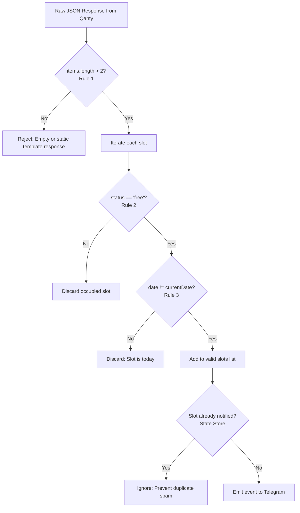

# OpenSpec: Qanty Availability Poller & Rules Engine (AP-SPEC)

**ID**: `availability-poller`  
**Version**: `1.0.0`  
**Status**: `Active`  
**Related Guardrails**: `G-NET-01`, `G-NET-02`, `G-NET-03`, `G-BIZ-01`, `G-BIZ-02`

---

## 1. Purpose & Scope

This module serves as the primary sensor of the system. Its sole responsibility is querying the Qanty appointment schedule endpoint and determining, through deterministic evaluation of the 3 business rules, whether genuine available slots exist to notify the user.

---

## 2. API Integration Contract

### 2.1. Endpoint Specification
- **URL**: `https://qanty.com/p/appointments/list_day_schedule`
- **HTTP Method**: `POST`
- **Mandatory Headers**:
  - `Content-Type`: `application/json`
  - `Accept`: `application/json, text/plain, */*`
  - `User-Agent`: Realistic desktop browser signature
  - `Referer`: `https://qanty.com/`
  - `Referrer-Policy`: `strict-origin-when-cross-origin`
- **Base Payload**:
  ```json
  {
    "branch_id": "string | number",
    "service_id": "string | number",
    "start_date": "YYYY-MM-DD",
    "end_date": "YYYY-MM-DD"
  }
  ```

### 2.2. Branch Discovery & Configuration Contract
- **URL**: `https://qanty.com/p/get_branches`
- **HTTP Method**: `POST`
- **Session Prerequisite**: Requires established company session (`c=Lpds45xBMVIpsXiSxaTy`) via portal initialization. Direct unauthenticated requests return `INVALID_SESSION`.
- **Branch Resolution**:
  - Default Target: Branch ID `6035` (Medellín Dispensary).
  - Configurable via `TARGET_BRANCH_ID` and `TARGET_BRANCH_NAME` in `.env`.
  - Multi-branch monitoring supported via comma-delimited `TARGET_BRANCH_IDS`.
  - Interactive CLI discovery provided via `npm run list:branches`.

---


## 3. The 3 Business Rules Engine

The rules engine acts as an integrity gate before any notification event is dispatched:



### 3.1. Formal Definition of the 3 Rules
1. **Rule 1 (Data Multiplicity)**: The API must return more than 2 items (`rawItems.length > 2`). Responses with 0, 1, or 2 items indicate empty schedule frames or static placeholder responses.
2. **Rule 2 (Availability Status)**: The slot's `status` or `state` field must be explicitly `'free'` or `'available'`.
3. **Rule 3 (Future Date Only)**: The slot's `date` or `day` must not match the current date (`slot.date !== currentDate`). Same-day appointments are excluded due to cutoff deadlines and clinic closures.

---

## 4. Enforced Guardrails in this Layer

- **`G-NET-01`**: Minimum baseline polling interval of 30 seconds.
- **`G-NET-02`**: Anti-fingerprinting random jitter ($\pm 5\text{s}$ to $\pm 15\text{s}$) on every cycle.
- **`G-NET-03`**: Circuit Breaker pausing requests for 10 minutes upon HTTP 429 or 403 responses.
- **`G-BIZ-02`**: State Store deduplication guaranteeing zero duplicate alerts in Telegram.
