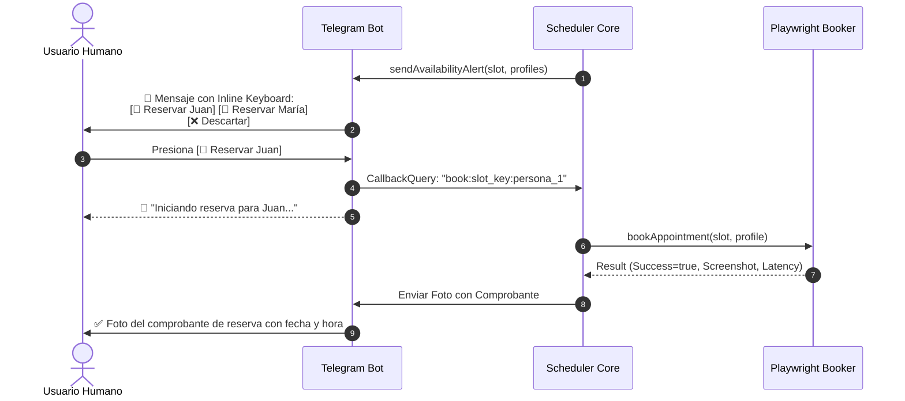

# OpenSpec: Telegram Interactive Notifier (TN-SPEC)

**ID**: `telegram-notifier`  
**Version**: `1.0.0`  
**Status**: `Active`  
**Related Guardrails**: `G-SEC-02`, `G-ACT-01`, `G-ACT-05`

---

## 1. Propósito y Alcance

Este módulo gestiona la interfaz interactiva con el usuario humano vía Telegram. Actúa como el puente de decisión ("Human-in-the-Loop") para autorizar reservas y recibir comprobantes fotográficos en tiempo real.

---

## 2. Flujo de Interacción y Botones Dinámicos



---

## 3. Especificación de Mensajería y Teclados Inline

### 3.1. Mensaje de Alerta de Disponibilidad
```text
🚨 *¡CITA DISPONIBLE ENCONTRADA EN QANTY!*

📅 *Fecha:* `2026-10-20`
⏰ *Hora:* `08:30 AM`
🏢 *Sede:* `Sede Principal`
💊 *Servicio:* `Dispensación Medicamentos`

👇 *Selecciona la persona para agendar de inmediato:*
[ 👤 Reservar para Alex ] [ 👤 Reservar para Mamá ]
[ ❌ Descartar ]
```

### 3.2. Formato del Callback Data
El payload de cada botón inline sigue la convención compacta:
`book:<slotHash>:<profileId>` o `dismiss:<slotHash>`.

---

## 4. Guardrails Aplicados en esta Capa

- **`G-ACT-01` (Human-in-the-Loop)**: Ninguna cita es reservada sin la pulsación de un botón interactivo del teclado inline.
- **`G-SEC-02` (Data Masking)**: Los comandos de consulta (como `/perfiles`) ocultan los dígitos sensibles de los documentos de identidad (`******7890`).
- **`G-ACT-05` (Evidencia Auditada)**: La respuesta del proceso siempre devuelve una captura visual (`screenshot`) adjunta al mensaje de confirmación o fallo.
