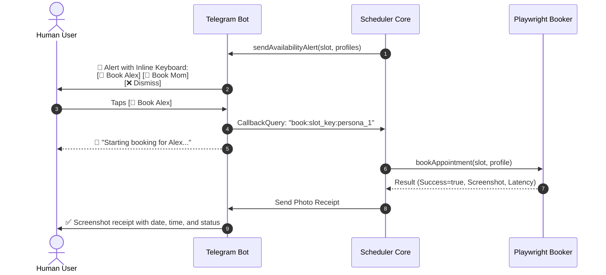

# OpenSpec: Telegram Interactive Notifier (TN-SPEC)

**ID**: `telegram-notifier`  
**Version**: `1.0.0`  
**Status**: `Active`  
**Related Guardrails**: `G-SEC-02`, `G-ACT-01`, `G-ACT-05`

---

## 1. Purpose & Scope

This module manages real-time human interaction via Telegram. It serves as the critical "Human-in-the-Loop" decision gateway for authorizing bookings and receiving photo confirmation receipts in real-time.

---

## 2. Interaction Flow & Dynamic Buttons



---

## 3. Messaging & Inline Keyboard Specification

### 3.1. Availability Alert Message
```text
🚨 *AVAILABLE MEDICINE PICKUP SLOT DETECTED!*

📅 *Date:* `2026-10-20`
⏰ *Time:* `08:30 AM`
🏢 *Branch:* `Main Dispensary`
💊 *Service:* `Prescription Medicine Pickup`

👇 *Select profile to book immediately:*
[ 👤 Book Alex ] [ 👤 Book Mom ]
[ ❌ Dismiss ]
```

### 3.2. Callback Data Format
Compact payload format: `book:<slotHash>:<profileId>` or `dismiss:<slotHash>`.

---

## 4. Enforced Guardrails in this Layer

- **`G-ACT-01` (Human-in-the-Loop)**: No appointment is booked without explicit button click confirmation.
- **`G-SEC-02` (Data Masking)**: Profile queries (e.g. `/profiles`) mask document IDs (`******7890`).
- **`G-ACT-05` (Audited Evidence)**: Booking results always deliver a timestamped PNG screenshot back to Telegram.
